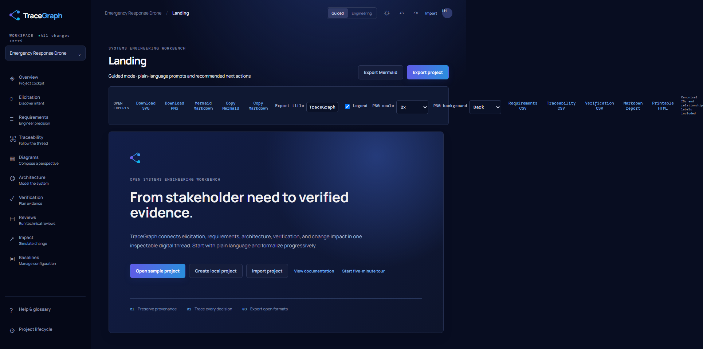
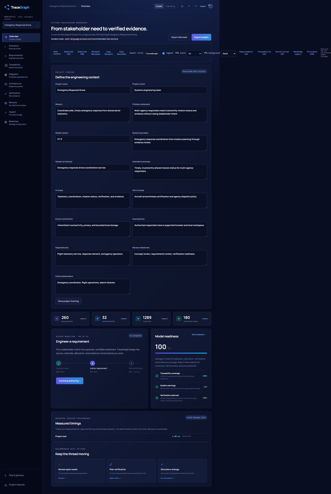

# TraceGraph

TraceGraph is a local-first requirements engineering and digital-thread workbench. It connects stakeholder intent, requirements, architecture, verification evidence, and change impact in one inspectable model.

## Current vertical slice

The public demo ships with a synthetic Emergency Response Drone project and supports guided and engineering modes, a restartable five-minute tour, elicitation provenance, editable requirement authoring with version history, explainable quality status, canonical SysML/UML/SoSE profile views, an accessible trace graph alternative, verification matrix authoring, evidence attachment, auditable change-request application, baselines, local persistence, validated JSON project import/export, undo/redo, Mermaid/SVG/PNG export, CSV matrices, Markdown reports, printable HTML reports, and persisted dark/light themes.

The deterministic seed contains 25 stakeholders, 60 elicitation records, 100 needs, 260 requirements, 32 architecture elements, 180 verification cases, 170 evidence records, 50 risk/decision records, 10 constraints, 4 change requests, 4 review sessions, and more than 1,200 trace links. Two synthetic baselines are included.

## Product vision and differentiators

TraceGraph makes engineering traceability a connected activity rather than a
collection of disconnected forms. A user can start with an interview note,
preserve its provenance, formalize a need into a measurable requirement, relate
it to architecture, plan verification, inspect evidence, simulate change, and
export the resulting digital thread.

The product is deliberately positioned as an approachable, inspectable
workbench rather than a replacement for certified enterprise MBSE tooling. Its
distinctive choices are progressive formalization, one canonical model behind
many views, explainable analysis, a SysML-oriented vocabulary without a
notation barrier, native SoSE context, open exports, no-account onboarding, and
reversible local-first interaction.

## Main workflows

- Guided onboarding through the Emergency Response Drone sample.
- Stakeholder discovery, elicitation capture, candidate-need review, and
  provenance-preserving need-to-requirement conversion.
- Structured requirement authoring, quality findings, decomposition, metadata,
  version comparison, and canonical relationship editing.
- SysML-oriented requirements, block, internal-block, activity, sequence, state,
  context, allocation, and verification views.
- UML use-case, class, component, deployment, sequence, and state projections
  over the same metamodel.
- SoSE mission-thread, constituent-system, capability-allocation,
  operational-dependency, and interoperability views.
- Trace exploration, matrix authoring, coverage metrics, verification methods,
  test cases, evidence attachment, impact simulation, and baseline comparison.

## Modeling scope

The canonical model is shared by Core TraceGraph, SysML, UML, SoSE, and Custom
profiles. The current modeling views are practical, clearly labeled
projections, not claims of formal SysML or UML conformance. Relationships retain
stable IDs, endpoint validation, rationale, confidence, provenance, review, and
baseline metadata. Diagram elements remain references to canonical artifacts.

## Technology stack

TraceGraph is a Vite, React, and TypeScript application with Vitest,
Playwright, axe-core, Prettier, and Oxlint. Persistence is isolated behind a
browser repository using IndexedDB with a localStorage fallback. The current
application is a local-first modular monolith; a server adapter is intentionally
not included in the guest demo.

## Screenshots





## Quick start

```bash
npm install
npm run dev
```

Checks: `npm run format:check`, `npm run lint`, `npm run typecheck`, `npm run test`, `npm run test:e2e`, `npm run test:accessibility`, and `npm run build`.

## Local development

Use `npm run dev` for the development server or `npm run build` followed by
`npm run preview` to inspect the production bundle. Browser project data is
stored locally; no environment variables are required for the demo. The
sanitized `.env.example` is retained for future deployment adapters.

Project content is persisted through a browser repository using IndexedDB with a localStorage migration/fallback, a versioned local bundle, and bounded audit history. Mermaid source, CSV matrices, Markdown, printable HTML, SVG, PNG, and JSON are open and portable. Server-backed persistence is intentionally outside the guest experience.

## Export formats

The export surface includes Mermaid source and fenced Markdown, clipboard copy,
SVG, bounded 1x/2x/3x/4x PNG, CSV requirements, CSV traceability, CSV
verification, Markdown reports, printable HTML, JSON project bundles, and
selected Diagram Studio perspectives. Large graphs retain lossless full-content
SVG export while browser-safe raster bounds protect PNG generation.

## Architecture

`src/model.ts` owns canonical artifact and relationship types plus deterministic Mermaid, CSV, Markdown, HTML, and SVG generation. `src/profiles.ts` defines the SysML, UML, SoSE, Core TraceGraph, and Custom vocabulary/view projections. `src/App.tsx` composes workflow views over that model; `src/repository.ts` isolates IndexedDB persistence and the localStorage fallback.

## Accessibility and privacy

The interface provides keyboard-focus styling, semantic labels, table and text alternatives for graph views, and does not transmit project content. This is an MVP accessibility baseline, not a claim of certification.

## Testing

The unit suite covers canonical model validation, relationships, metrics,
diagnostics, serialization, and exports. The critical Playwright workflow
covers elicitation through recovery and export; the accessibility workflow
runs axe checks against the landing page and workbench. The long critical
workflow has a 60-second workflow budget; that is not a product performance
claim.

## Limitations

The supplied logo asset was not present in the repository or referenced attachments. The current CSS mark and `public/brand/tracegraph-fallback-*` assets are deterministic fallbacks, not the final brand asset; replace them with the owner-provided source before public launch. Full diagram authoring, standards-complete SysML/UML/SoSE editors, and server-backed collaboration remain planned.

## Roadmap

Next priorities are import conflict resolution beyond replacement review,
diagram versioning, richer standards semantics, virtualized large-model tables,
export progress/cancellation, a server-backed repository adapter, and the
owner-provided brand assets.

## Contributing and security

See [CONTRIBUTING.md](CONTRIBUTING.md) for branch and validation conventions.
Report security concerns privately according to [SECURITY.md](SECURITY.md);
do not place sensitive operational data in the public synthetic demo.

## License

No license file was present at project creation. Licensing should be selected by the repository owner before public distribution.
